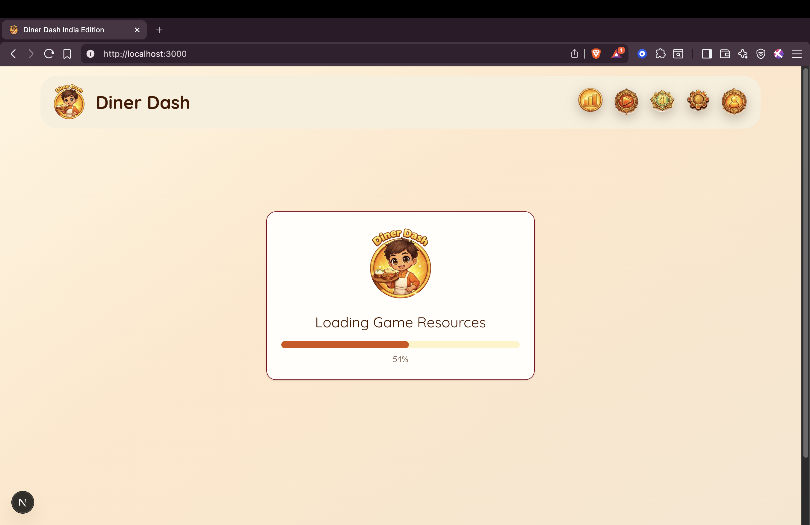
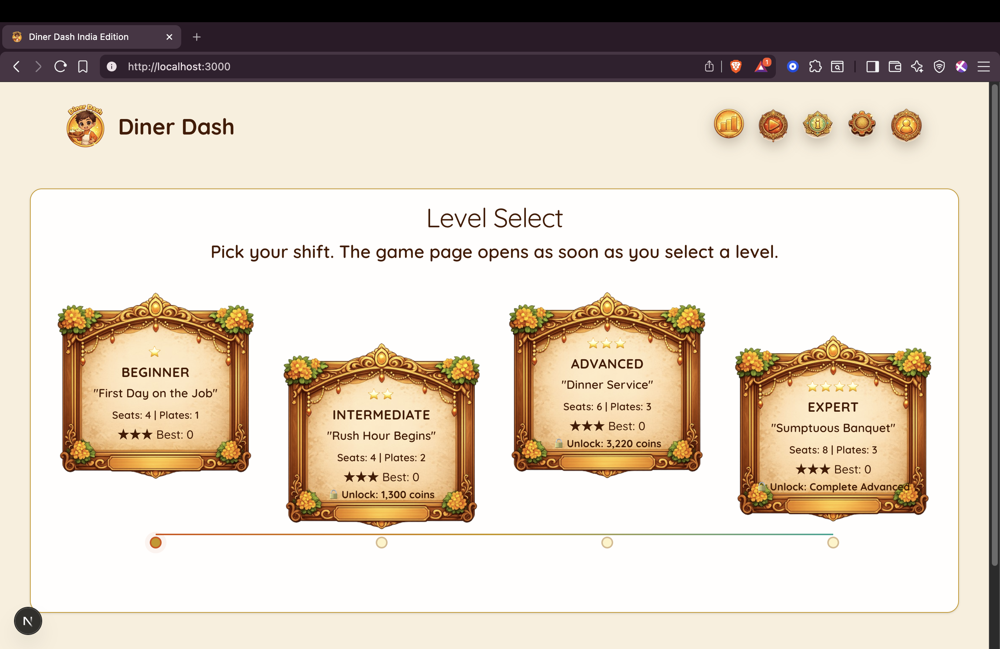
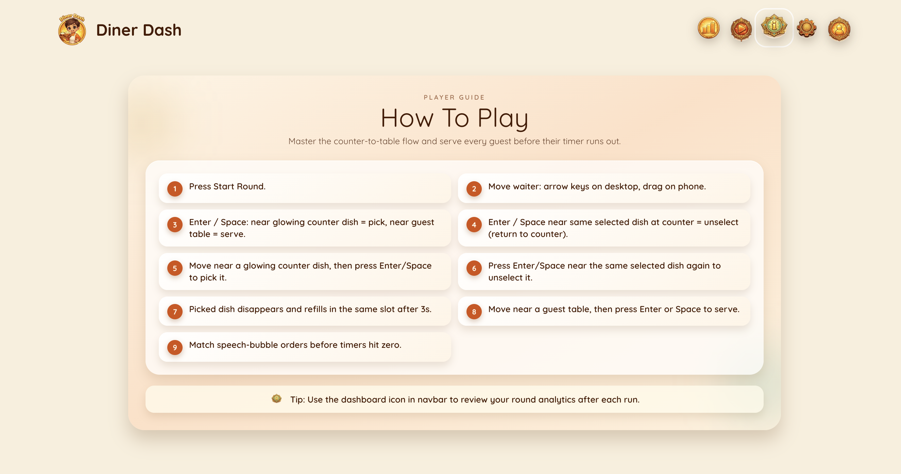
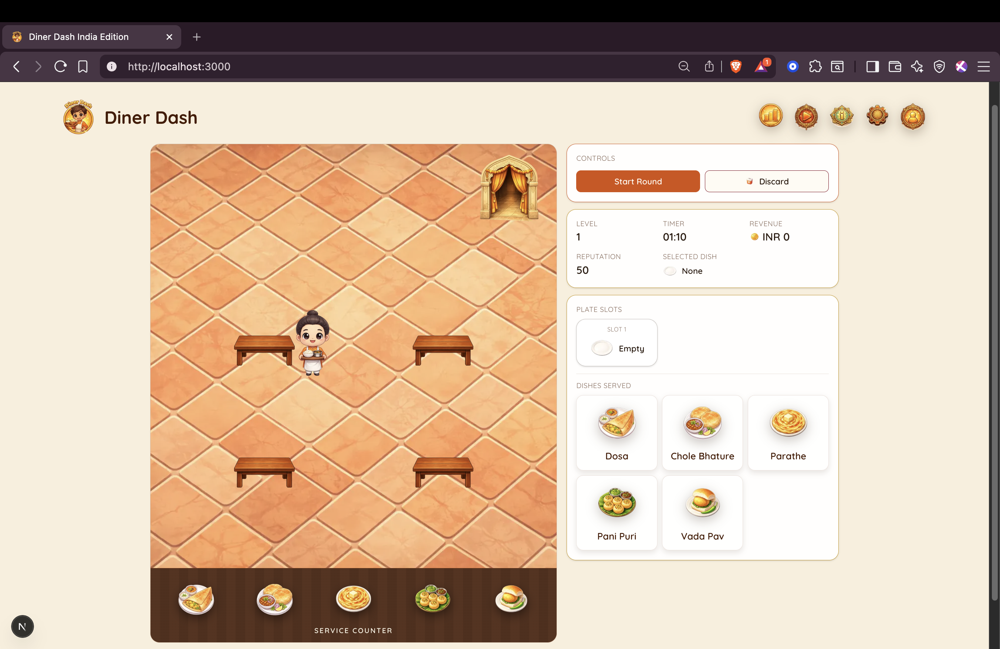
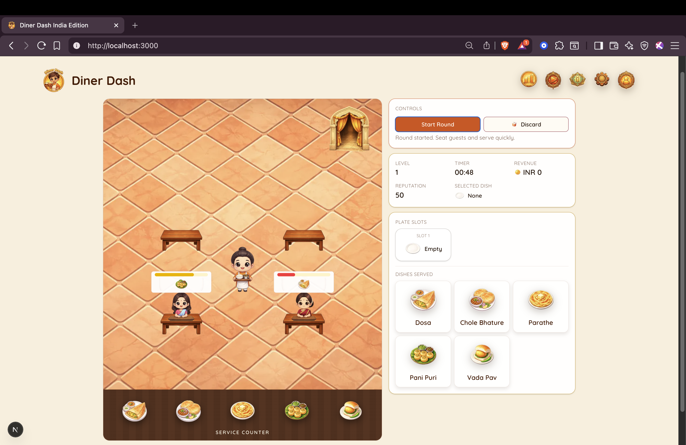
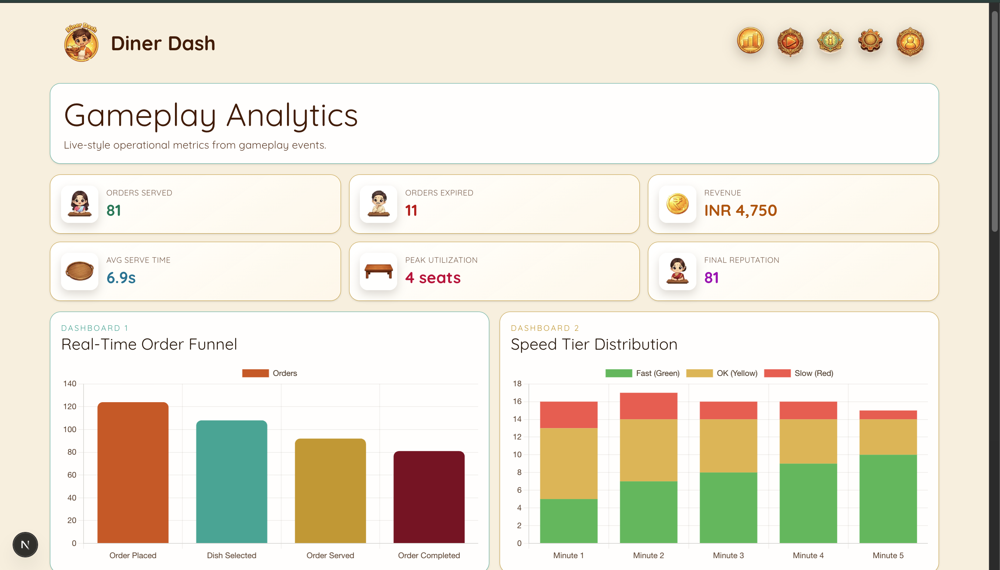
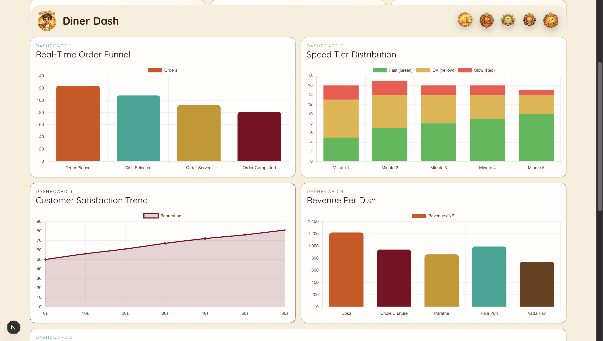
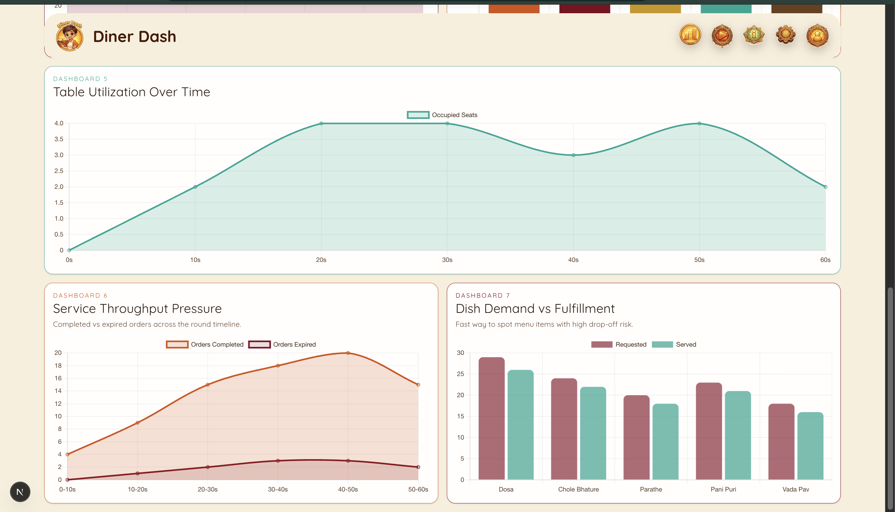

<p align="center">
  
</p>

<h1 align="center">Diner Dash</h1>

<p align="center">
  A fast-paced restaurant simulation where every gameplay action emits structured events and powers live operational analytics.
</p>

<p align="center">
  <a href="https://github.com/0xvaishnavi/DinerDash">GitHub</a> &nbsp;&middot;&nbsp;
  <a href="https://dinerdash.vercel.app">Live Demo</a> &nbsp;&middot;&nbsp;
  <a href="https://drive.google.com/file/d/1jwgMvpxiJzxvR8nJX7tFNJPRJR0VIAmv/view?usp=drive_link">Demo Video</a>
</p>


## 🖼 Preview

| | |
|:-:|:-:|
|  |  |
|  |  |
|  |  |
|  |  |

## 🎮 Game Idea

- Customers walk in, sit at a table, and place orders via speech bubbles.
- Pick up dishes from the counter, carry them over, and serve before patience runs out.
- Faster serves earn more coins and reputation — expired orders cost you reputation.
- Four levels scale the chaos: from 4 tables with a single plate, up to 8 tables with rapid-fire arrivals and triple plate juggling.
- Every gameplay action emits structured event data (12 event types across the full lifecycle).
- Events flow through ingestion into Snowflake, powering a live analytics dashboard.
- Dashboard covers funnel drop-off, SLA speed bands, table utilization, satisfaction, and dish profitability.

## 🏗 Architecture

<p align="center">
  
</p>

## 📊 Dashboard Views

- Real-Time Order Funnel
- Speed Tier Distribution
- Customer Satisfaction Trend
- Revenue Per Dish
- Table Utilization Over Time
- Service Throughput Pressure
- Dish Demand vs Fulfillment

Additional validation panel includes:
- total events
- distinct event types
- missing event types
- last event timestamp
- top event counts

## 🛠 Tech Stack

| Layer | Technology |
|---|---|
| Framework | Next.js 16 (App Router) |
| UI | React 19 + TypeScript |
| Styling | Tailwind CSS v4 |
| Animation | Framer Motion |
| State | Zustand |
| Charts | Chart.js + react-chartjs-2 |
| API | Next.js API Routes |
| Validation | Zod |
| Data Warehouse | Snowflake SDK |
| Linting | ESLint + Prettier |
| Testing | Vitest |

## 📁 Project Structure

```text
src/
  app/
    api/event/route.ts
    api/dashboard/metrics/route.ts
    dashboard/page.tsx
    info/page.tsx
    page.tsx
  components/
    game/
    dashboard/
  lib/
    events/
    game/
    snowflake/
```

## 🚀 Local Setup

### Prerequisites
- Node.js 20+
- npm 10+

### Install and Run

```bash
npm install
cp .env.example .env.local
npm run dev
```

Open: [http://localhost:3000](http://localhost:3000)

## 🔐 Environment Variables

From `.env.example`:

```bash
NEXT_PUBLIC_EVENT_ENDPOINT=/api/event

KAFKA_BROKERS=localhost:9092
KAFKA_TOPIC=diner-dash-events
KAFKA_CLIENT_ID=diner-dash-web

SNOWFLAKE_ACCOUNT=your-account-identifier
SNOWFLAKE_USERNAME=your-username
SNOWFLAKE_PASSWORD=your-password
SNOWFLAKE_DATABASE=DINER_DASH
SNOWFLAKE_SCHEMA=GAME_EVENTS
SNOWFLAKE_WAREHOUSE=COMPUTE_WH
SNOWFLAKE_ROLE=ACCOUNTADMIN
```

## 📜 Useful Scripts

```bash
npm run dev
npm run build
npm run start
npm run lint
npm run typecheck
npm run test
npm run test:e2e
```
